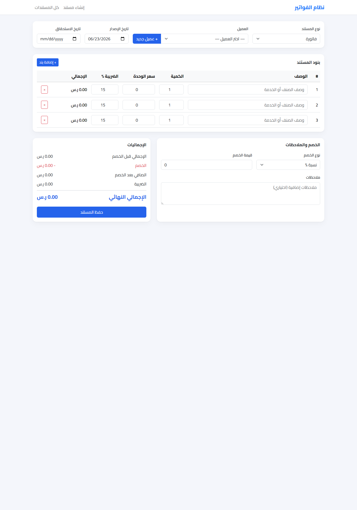
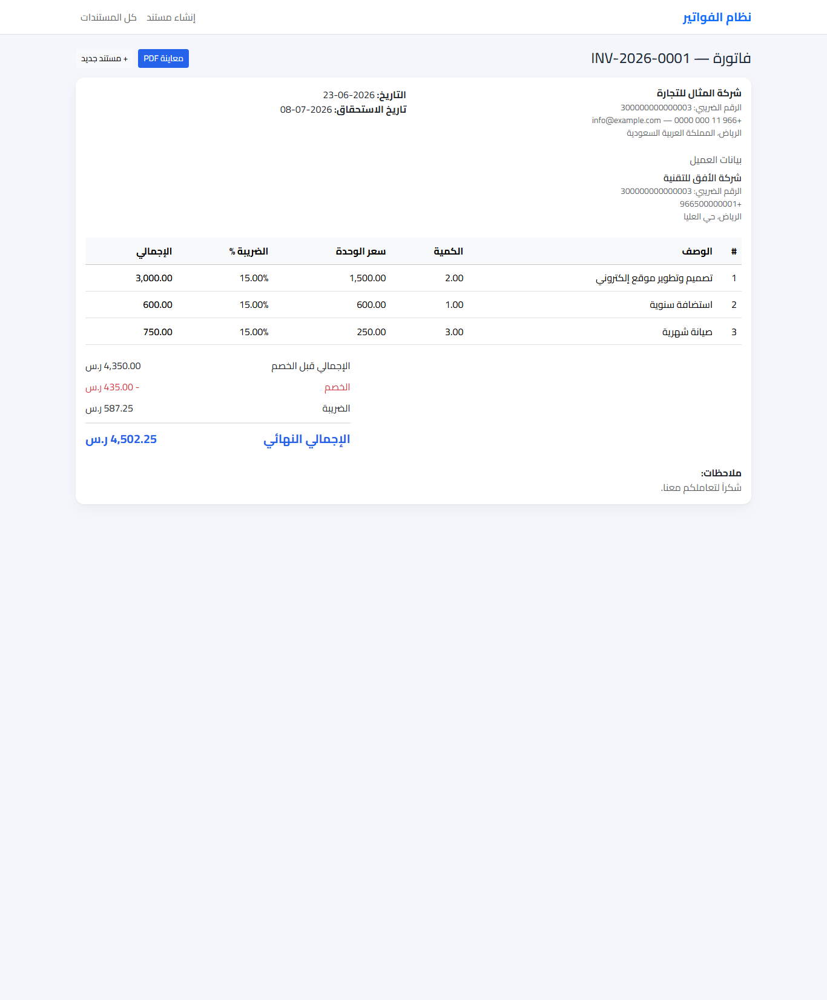
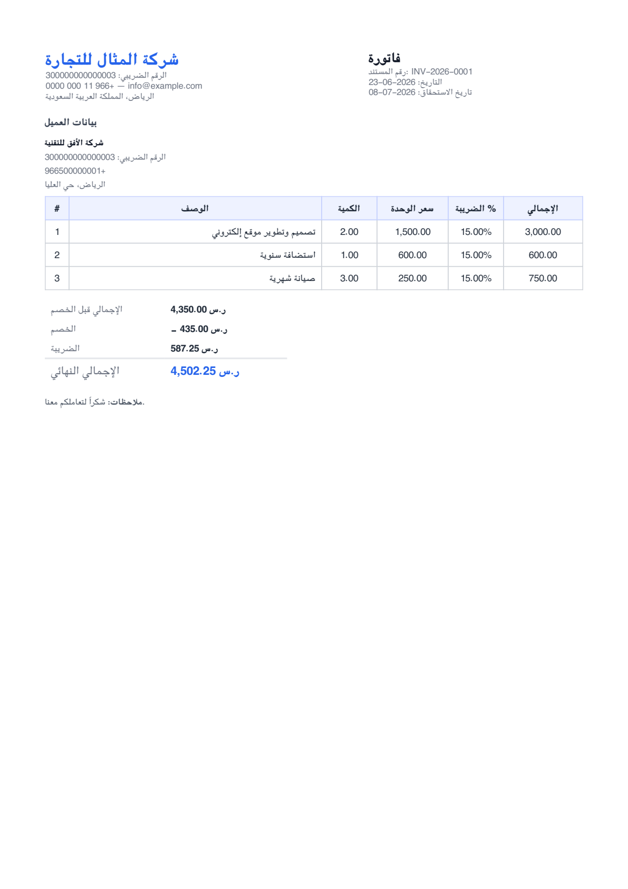
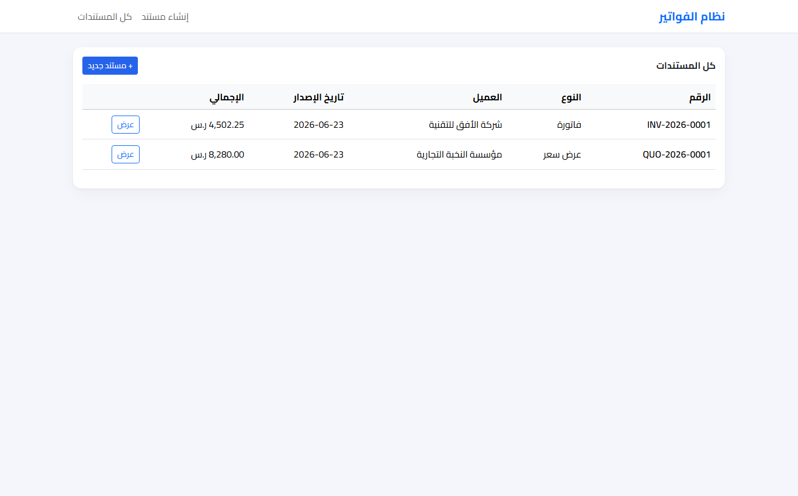

# نظام الفواتير — Arabic RTL Invoice / Quotation Module

A focused Laravel assessment module for creating **Arabic (RTL)** invoices and quotations with
live front‑end totals, authoritative **server‑side recalculation**, MySQL persistence, and an
**Arabic PDF preview** generated with mPDF.

> Scope is intentionally limited to the assessment requirements: no authentication, inventory,
> payments, or full ERP features.

---

## Tech Stack

| Layer | Choice |
|-------|--------|
| Framework | Laravel 12 |
| Language | PHP 8.3 |
| Database | MySQL 8 |
| Front‑end | Blade + Alpine.js + Bootstrap 5 RTL (via CDN — no build step) |
| PDF | mPDF (RTL, bundled **XB Riyaz** Arabic font) |

---

## Requirements

- PHP **8.3+** with `mbstring`, `gd`, `pdo_mysql` extensions (required by mPDF / Laravel)
- Composer 2
- MySQL 8 (or MariaDB)

No Node/npm is required — the UI loads Bootstrap RTL and Alpine.js from a CDN.

---

## Installation

```bash
# 1. Clone
git clone https://github.com/ahmedmakled517/invoice.git
cd invoice

# 2. Install PHP dependencies
composer install

# 3. Environment
cp .env.example .env
php artisan key:generate

# 4. Create the database (MySQL)
#    CREATE DATABASE invoice CHARACTER SET utf8mb4 COLLATE utf8mb4_unicode_ci;
#    then set DB_DATABASE / DB_USERNAME / DB_PASSWORD in .env

# 5. Migrate + seed sample data
php artisan migrate --seed

# 6. Run
php artisan serve
```

Then open <http://127.0.0.1:8000> — the root redirects to the document creation page.

### Sample data

`php artisan migrate --seed` creates 4 customers, one sample **invoice** (`INV-2026-0001`)
and one sample **quotation** (`QUO-2026-0001`) so the screens have data immediately.

---

## Usage

| Route | Description |
|-------|-------------|
| `GET /invoices/create` | Create a new invoice / quotation |
| `POST /invoices` | Store (server recalculates + validates) |
| `GET /invoices` | List all documents |
| `GET /invoices/{id}` | View a document |
| `GET /invoices/{id}/pdf` | Inline Arabic PDF preview |
| `POST /customers` | Add a customer (used by the AJAX modal) |

The create page supports: a customer dropdown, an **“add customer”** modal (saved via AJAX),
dynamic item rows (add/remove), and a document‑type switch (invoice ↔ quotation).

---

## Calculation logic

The same formula runs on the **front‑end** (Alpine, for instant UX feedback) and on the
**server** (`App\Services\InvoiceCalculator`, the single source of truth). The discount is
applied at the **invoice level** and tax is applied **per line**:

```
line_subtotal[i] = round(quantity[i] × unit_price[i], 2)
items_subtotal   = Σ line_subtotal[i]

discount_amount  = percent → round(items_subtotal × value / 100, 2)
                   fixed   → min(value, items_subtotal)

discount_ratio   = items_subtotal > 0 ? discount_amount / items_subtotal : 0

# the invoice-level discount is distributed proportionally across lines BEFORE tax
taxable[i]  = round(line_subtotal[i] × (1 − discount_ratio), 2)
line_tax[i] = round(taxable[i] × tax_rate[i] / 100, 2)

tax_total   = Σ line_tax[i]
grand_total = items_subtotal − discount_amount + tax_total
```

Proportional allocation keeps the result correct even when lines have **different tax rates**.

### Server‑side recalculation (important)

Any totals sent by the browser are **ignored**. On `POST /invoices` the controller passes only
the raw inputs (quantity, unit price, tax rate, discount) to `InvoiceCalculator`, recomputes
every amount, and persists the invoice and its items inside a **database transaction**. This is
covered by an automated test that submits tampered totals and asserts the stored values are the
correct, recalculated ones.

---

## PDF generation

- Built with **mPDF** in `InvoiceController@pdf`.
- `directionality = rtl`, `autoArabic` and `autoScriptToLang` enabled for correct Arabic shaping
  and bidi.
- Uses mPDF’s bundled **XB Riyaz** Arabic font (no external font files needed).
- The Blade view `resources/views/pdf/invoice.blade.php` is rendered to HTML and streamed
  **inline** so the browser previews it directly.

---

## Validation

`StoreInvoiceRequest` and `StoreCustomerRequest` (Form Requests) handle validation with
**Arabic messages**, including: required customer that must `exist`, dates not before the issue
date, at least one item, and per‑item quantity / price / tax‑rate rules. A percentage discount is
additionally capped at `max:100`.

---

## Testing

```bash
php artisan test
```

The suite has **35 tests** covering every part of the project:

| Test | Covers |
|------|--------|
| `Unit\InvoiceCalculatorTest` | calculation logic: totals, percent/fixed discount, capping, mixed tax rates |
| `Feature\InvoiceModelTest` | model relations, `typeLabel`/`isQuotation`, casts, cascade delete |
| `Feature\InvoicePageTest` | root redirect, index / create / show pages, 404 handling |
| `Feature\InvoiceStoreTest` | server recalculation ignoring tampered totals, number generation, quotation, all validation rules |
| `Feature\CustomerTest` | customer creation (JSON + form) and validation |
| `Feature\InvoicePdfTest` | inline PDF generation |

Tests run on an in‑memory SQLite database (configured in `phpunit.xml`).

---

## Project structure

```
app/
  Http/Controllers/   InvoiceController.php · CustomerController.php
  Http/Requests/      StoreInvoiceRequest.php · StoreCustomerRequest.php
  Models/             Customer.php · Invoice.php · InvoiceItem.php
  Services/           InvoiceCalculator.php
database/
  migrations/         customers · invoices · invoice_items
  seeders/            CustomerSeeder.php · InvoiceSeeder.php
resources/views/
  layouts/app.blade.php
  invoices/           create · index · show
  pdf/invoice.blade.php
config/invoice.php     company info · currency · default tax rate
```

---

## Screenshots

| Create page | Document view |
|---|---|
|  |  |

| PDF preview | Documents list |
|---|---|
|  |  |

---

## Configuration notes

Company details, currency label, and the default tax rate live in `config/invoice.php` and can be
overridden via `.env` (`INVOICE_COMPANY_NAME`, `INVOICE_CURRENCY_LABEL`, `INVOICE_DEFAULT_TAX_RATE`, …).
The default currency is SAR with a 15% VAT rate.
